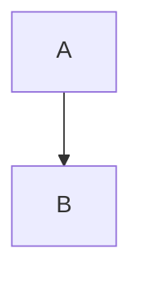
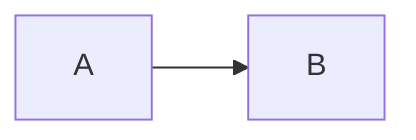
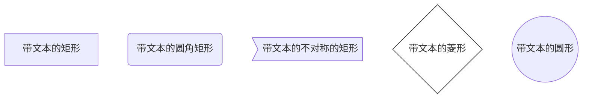
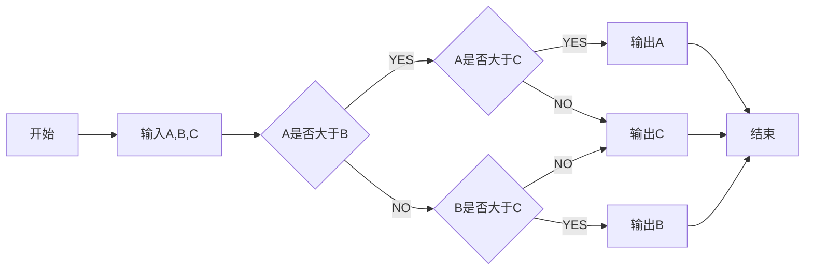

1. 连接

- hello [google](https://www.google.com)

- <https://www.google.com>

2. 段落

>

3. **希腊字母与公式**
- 公式: $ $
- 上下标
    ``上标: ^``
    ``下标: _``
    $x_{i_1}^{20}$
- 字母表示
    - $\Sigma$
    - $\lambda$
    - $\pi$
    - $\epsilon$ 与$\varepsilon$

- 集合运算
    - $\cup$ ∪
    - $\cap$ ∩
    - $\in$ ∈
    - $\subset$ 真子集
    - $\subseteq$ 子集
    - $\emptyset$ 空集
    - $\forall$ 任意
    - 
- 函数式：$$f(x)=\frac{P(x)}{Q(x)}$$
- 下划线
$\_$

- 表格

|  表头   | 表头  |
|  ----  | ----  |
| 单元格  | 单元格 |
| 单元格  | 单元格 |

``-:``右对齐
``:-:``居中对齐
``:-``左对齐

| 符号 | 含义 |
| :----  | :----: |
| a ::= b | a定义为b |

- |

$\mid$ : |

- 代码段
<code >$\rightarrow$ </code>

- 流程图

>
    id + [文字描述]矩形
    id + (文字描述)圆角矩形
    id + >文字描述]不对称的矩形
    id + {文字描述}菱形
    id + ((文字描述))圆形

- 插入图片
函数调用关系 </img>
