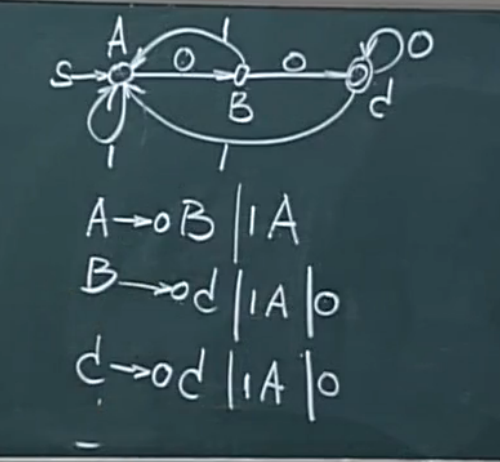

# 3.词法分析Lexer
1. 词法分析器的功能
2. 词法分析器表示 RG,RE,FA
3. 词法分析器设计与实现

## 1.词法分析器的功能
字符串 $\rightarrow$ 单词
- 单词:(单词种别, 属性值)
- 例子:
while(p!=N){S=S++;p++;}

|单词|二元组|
|:-:|:-:|
|while| (while,_)|
|(|(SLP,_)|
|p|(ID, 符号表指针)|
|!=|(NE,_)|
|)|(SRP,_)|
|...|...|

- 缓冲: 并行,连接
- 双缓冲
- 标识符的文法描述
$I(I|d)^*$
Ex.$dd^*$

## 2.正则表达式 RE

- 运算优先级
- 右线性文法 句柄处理

|词法规则|单词种别|属性|
|:-:|:-:|:-:|
|$<标识符> \rightarrow <字母>(<字母>\mid<数字>)^* $ |IDN |符号表项入口|

## 正则文法 与 正则表达式的相互转换

1. 代入
2. 递归
3. 多候选

## 3. 有穷状态 自动机
``缺省的陷阱状态/出错处理``

其他 对应 $\varepsilon$

**状态  对应 文法的变量**

- 正规文法转化为状态转移图
    $特例: A \rightarrow \varepsilon$

- 状态转移图 $\rightarrow$ 正规文法

 </img>

$注意: 没有C\rightarrow \varepsilon是因为其处理困难$

## 4.程序设计
回退字符

- 问题
  * 缓冲区预处理

- 扫描器的自动生成
