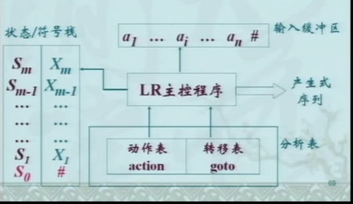

# 4.2自然向上 ``算符优先, LR``

>思想:
    从输入串出发,反复利用产生式进行**归约**.
如果最后得到开始符号,则输入串是句子, 否则有语法错误

>核心:
    寻找句型当前归约的对象--**句柄**进行归约.
不同方法寻找句柄--不同分析方式

``句柄: 最左直接短语``

## 构成

``实现对输入token序列的归约``

1. 栈
2. 输入串 
3. 被归约的对象在栈顶形成
   1. 知道当前归约对象是否在栈顶形成
   2. 当前归约对象的长度

栈+当前缓冲区剩余=当前"句型" ``#是反的``

## 分析设想--移进归约

**核心问题:??如何发现句柄已经在栈顶形成**

### 分析器的四种动作

 1. 移进: 下一输入符号入栈
 2. 归约: 用产生式左部替换栈顶句柄
 3. 接受-分析成功
 4. 出错

### 移进归约中的问题

1. 移进归约冲突
   1. 可以移进可也归约
2. 归约归约冲突
   * 存在两个可用的产生式
      * ``输入:abbce``, $产生式: A \rightarrow Ab|b, B \rightarrow b$
3. 如何识别句柄
   1. 如何保证找到的归约对象是最左的
      1. 利用栈
   2. **??如何确定句柄开始与结束处**

``??如何解决冲突``

# 算符优先分析法

- 启示: 算符表达式分析,规定优先关系
- 直观意义:
   1. ``+ < *``
   2. ( = )
   3. ``+ > +``
- 方法
    - 将句型的终结符当成算符

## 算符文法OG

**不存在$A \rightarrow \alpha BC \beta$**``即两个变量不挨着出现``

## 算符优先文法

>定义:
设$G=(V_T, V_N,P,S)为OG$
如果$\forall a,b \in V_T, a \equiv b, a <b, a>b至多有一个成立,则称之为算符优先文法OPG$

- 算符优先关系的确定

  - a < b $\Leftrightarrow A \rightarrow ...aB... \in P且B\stackrel{+}{\Rightarrow}b...或者B\stackrel{+}{\Rightarrow} Cb... $
  - 求出非终结符B派生出的**第一个终结符构成的集**
  - a > b $\Leftrightarrow A \rightarrow ...Bb... \in P 且(B\stackrel{+}{\Rightarrow}...a或者B\stackrel{+}{\Rightarrow}...aC)$
  - 求出变量B派生出的**最后一个终结符构成的集**

- 设$G=(V_T, V_N, P,S)为OG, 则定义$
  - FIRSTOP(A)={$b|A\stackrel{+}{\Rightarrow}b... 或者A\stackrel{+}{\Rightarrow}Bb... , b\in V_T, B \in V_N$}
  - LASTOP(A) = {$b|A\stackrel{+}{\Rightarrow}...b 或者A\stackrel{+}{\Rightarrow}...bB , b\in V_T, B \in V_N$}
  - 第一个和最后一个终结符,而不是变量

- 确定算符优先关系
    - 如果$A \rightarrow ...ab...; A\rightarrow ...aBb... , 则 a = b$
    - 如果$A \rightarrow ...ab..., 则对 \forall b \in FIRSTOP(B), a<b$ ,后面先归约
    - 如果$A \rightarrow ...Bb...,则对 \forall a \in LASTOP(B), a>b$ , 前面先归约
    - $A \rightarrow X_1X_2...X_n$

``谁先归约,则其优先级高, 此外(比如: AaB)两个变量中间的终结符可看作屏障, 屏蔽了两个变量的优先级比较``

- 算符优先问题
  - 有时未归约真正的句柄
  - 不是严格的最左归约
  - 归约的符号串有时与产生式右部不同

- 素短语
  - $S \stackrel{*}{\Rightarrow}  \alpha A \beta and A \stackrel{+}{\Rightarrow} \gamma$
  - $\gamma 至少含一个终结符$
  - 且不含更小的含终结符的短语,则称$\gamma$是句型$\alpha \gamma \beta$的相对于变量A的素短语
  -**句型的至少含一个终结符且不含其他素短语的短语**
   - 终结符不要忘了``*``

- 计算方式
  - 双栈?

- 算符优先函数
   - 栈内,栈外

- 优点
  - 简单,效率高
  - 能够处理部分二义性文法
- 缺点
  - 文法书写限制大
  - 算法在发现最左素短语的尾,需要回头寻找对应的头
  - 不规范, 存在查不到的语法错误

问题:
   1. 必须是算符文法
   2. 效率低
   3. 不回头扫描就可以找到句柄

自顶向下和自底向上每一步根据文法的产生式进行派生和归约.
**??能否根据产生式记忆分析的过程---是否形成了什么样的句柄**

## LR分析

- 句柄是否形成,要看某个产生式有部是否形成
- **核心:$A \rightarrow \alpha.\beta$的项目建立状态**

   - $S \rightarrow .BB$
   - $S \rightarrow B.B$
   - $S \rightarrow BB.$

- L:从**左**到右扫描输入符号
- R:最右推导对应的最左**归约**
- k:超前读入k个符号, 以确定归约用的产生式
- 用状态刻画当前分析的进程, 解决句柄识别问题

1. 拓广文法
   1. 表示``归约成S``, $S' \rightarrow .S:分析开始; S' \rightarrow S.:分析成功$
2. LR(0)项目
   1. 项目: 产生式右部某个位置有点
      - $例: S \rightarrow .BB$
   2. 移近``Shift``项目: $S \rightarrow .bB$
   3. 待归约项目: $S \rightarrow b.BB$
   4. 归约``Reduce``项目: $S \rightarrow aB.$
   5. ``从产生式寻找归约对象的方法``
3. 项目意义
   圆点之前是处理过的, 圆点后希望得到的
4. 核心项目
5. LR(0)分析表
   1. sn: 符号a,状态n入栈
   2. rn: 第n个产生式进行归约
6. LR(k)分析器总体结构
   

### LR分析算法

``s:栈顶状态; a:当前输入符号``
- 算法流程
   - init: 栈中为``#, 状态0``, 输入指针ip指向输入的第一个符号
 
   - if action[s,a] = sj(shift j) 
     - 先压入符号a然后压入状态j
     - ip后移
  
   - else if $action[s,a] = rj(reduce B \rightarrow \beta$)
     - 从栈顶弹出$2 \times |\beta|$个符号
     - 把``B和goto[s',B]``先后压入栈中
     - 输出产生式$B \rightarrow \beta$
   - else if action[s,a] = acc //接受状态
     - return
   - else error

- 栈内容+剩余输入符号="规范句型"
- 规范句型的活前缀: 不含句柄右侧任意符号的前缀

### LR(0)分析表的构造

>$?? F \rightarrow \varepsilon$. $增加 F \rightarrow .$
   移近, 待约, 归约项目?

计算项目集闭包

- 项目集I的闭包
   CLOSURE(I) = $I \cup \lbrace B \rightarrow .\gamma | A \rightarrow \alpha .B \beta \in CLOSURE(I), B \rightarrow \gamma \in P  \rbrace$
- 算法: 用J表示CLOSURE(I)
   - J := I
   - repeat
     - $J = J \cup \lbrace B \rightarrow .\gamma | A \rightarrow \alpha .B \beta \in J, B \rightarrow \gamma \in P  \rbrace $
   - until J不再扩大

- 闭包之间的转移

- 项目集规范族``C``(分析器状态集合) --> DFA

**LR(0)不能处理所有的上下文无关文法**

- 因为有冲突

- 如何解决冲突?
  - 计算Follow集, 在Follow集里可归约,即``SLR(1)``分析

  - LR(0)与SLR(1)的不同
    - LR(0)分析表的构造 $if A \rightarrow \alpha. \in I_j then for \forall a \in V_T \cup \lbrace \sharp  \rbrace do action[i,a]=rj$
    - SLR(1)分析表的构造 $if A \rightarrow \alpha. \in I_j then for: \forall a \in FOLLOW(A), do action[i,a]=rj$

``LR(0)-->SLR(1)-->LR(1)-->LALR(1)``

### SLR(1) 

1. SLR(1)
   - 描述能力强于LL(1)
   - 还考虑FOLLOW集中的符号
   - ``SLR(1)也是有极限的!!!``
   - ??为什么每个状态都是终止状态
     - ``因为活前缀``

2. ``LR(1)``
   1. 运用后继符/搜索符
   2. 在构造状态时就考虑后继符
3. ``LALR(1)``
   1. ``LR(1)``合并状态得到``LALR(1)``

4. 程序自动完成语法工作
   - yacc

# 自底向上小结
- 基本框架
  - 移近归约分析
  - 核心: 句型中寻找句柄进行归约
  - 分析器具有基本相同的逻辑结构
- 控制算法
  - 基于算符优先关系表
  - 基于LR分析表(动作和状态转移)
