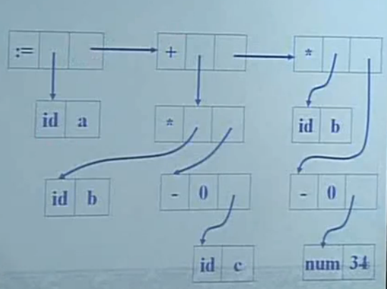

# 6.0-语义分析和中间代码生成

1. 中间代码
   1. 形式上变换
   2. 尽可能与机器无关
2. 赋值语句的翻译
3. 控制语句的翻译(if, 循环)
4. 属性文法的实现
5. 说明语句翻译

## 1.中间代码

- 三地址码
- 语法树
  - 抽象语法树
    - mknode, mkleaf
  - 带注释的语法树
- 后缀形式-逆波兰表示

### 表达式

- 例: ``a:=b*(-c)+b*(-34)``

1. 语法结构树: 

  - $S \rightarrow id:=E$:``S.p = mknode(':=',mkleaf(id,id.entry), E.p )``
  - $E \rightarrow (E1)$:``E.p = E1.p``
  -计算机实现? 数组存储

2. 逆波兰表示:``abc-*b34-*+:=``
    属性文法?
     - $S \rightarrow id:=E$ ``Print(id.name||E.code||":=")``
     - $E \rightarrow E1+E2$ ``E.code:=E1.code||E2.code||"+"``
     - $E \rightarrow E1*E2$ ``E.code:=E1.code||E2.code||"*"``
     - $E \rightarrow -E1$ ``E.code:=E1.code||"-"``
     - $E \rightarrow (E1)$ ``E.code:=E1.code``
     - $E \rightarrow id$ ``E.code := id.name``
     - $E \rightarrow num$ ``E.code := num.val``
     - 注: ``||``表示连接
     - **综合属性**

3. 三地址码

    - 一般形式``x := y op z``
      - ``x := y op z``双目
      - ``x := op z``单目
      - ``x := z``赋值
      - ``(relop, x,y,l)``条件转移
      - ``call p, n``过程调用
    - $S \rightarrow id:=E$ ``S.code := E.code || gen(id.place':='E.place)``
    - $E \rightarrow E1+E2$ ``E.place:=newtemp; E.code:=E1.code||E2.code||gen(E.place':='E1.place'+'E2.place) `` 
    - $E \rightarrow E1*E2$ ...
    - $E \rightarrow -E1$ ``E.place:=newtemp; E.code:=E1.code||gen(E.place':='-'E1.place) `` 
    - $E \rightarrow (E1)$ ``E.place:=E1.place; E.code:=E1.code``
    - $E \rightarrow id$ ``E.place:=id.place;E.code:=''``
    - $E \rightarrow num$``E.place:=num.val;E.code:=''``
    - 注: ``||``表示连接

### 说明语句

``说明程序规定范围内变量,常量, 过程``
- 在符号表中记录属性

``关心的问题``
- 类型
  - 基本类型: 整形, 字符...
  - 用户定义类型
  - 类型作用
    - 引入数据抽象
      ```c
      int x,y; 
      float x1;
      //我们需要把x转为float, 而做提前准备
      z = x+x1
      ```
    - 类型检测
    - 数据精度控制-储存空间优化
- 作用域--有效范围
  - 说明变量所在的作用域
  - **如何考虑范围呢?**


1. 变量说明的翻译
  - 在符号表中填写变量的属性
    - 种别, 类型, **相对地址**, 作用域
  - **相对地址与数据区的划分**
    - 全局变量
    - 局部变量: 局部数据区
    - 静态,动态
    - **宽度,偏移量,类型**
    ```c  
    float x[8];
    int i,j;
    ```
   - 类型T的属性: type 类型, width 占用的字节数
   - 基本子程序: enter 设置变量的类型和地址, array 数组类型处理
   - 全局量: offset 已分配空间字节数 
   - 基本类型翻译模式
     - $P \rightarrow \lbrace offset:=0 \rbrace D$
     - $D \rightarrow D;D$
     - $D \rightarrow id:T \lbrace enter(id.name, T.type, offset); offset:=offsetTT.width \rbrace$
     - $T \rightarrow int \lbrace T.type:=int; T.width:=4 \rbrace$
     - $T \rightarrow array[num] of T_1 \lbrace T.type:=array(num.val, T_1.type); T.width:= num.val*T_1.width \rbrace$
     - $T \rightarrow *T_1 \lbrace T.type:=pointer(T_1.type);T.width:=4 \rbrace$

   - 组合数据的说明
      - 数组(同质)
        - 分配策略
          - 静态
          - 动态: 运行时
        - ``内情向量``处理
          - 上下界的计算
          - 体积的计算
          - ``x := y[i]``
          - 行优先下数组元素地址计算
            - 一维数组A[low:up] (n=up-low+1)
              - ``Addr(A[i])=base+(i-low)*w = base-low+w+i*w=c+i*w``
            - 二维数组A[$low_1:up_1, low_2:up_2$]~A[i,j]
              - ``Addr(A[i,j])=c+(i*n1+j)*w``
      - 结构(异质)
      - 抽象数据类型
        - 类, 模板