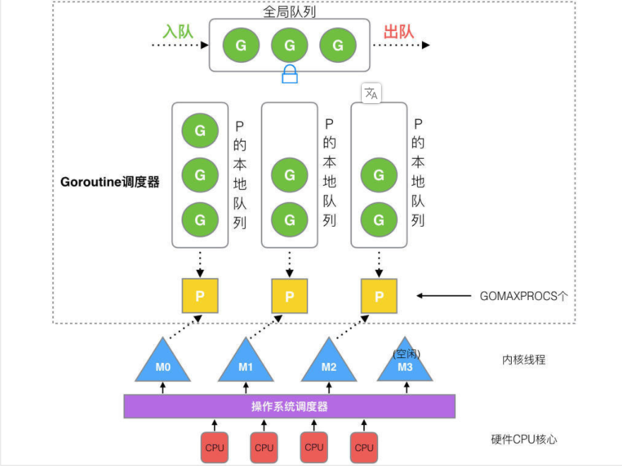

# Golang面试

## GMP调度
[参考](https://learnku.com/articles/41728)

1. 全局队列（Global Queue）：存放等待运行的 G。
2. P 的本地队列：同全局队列类似，存放的也是等待运行的 G，存的数量有限，不超过 256 个。新建 G’时，G’优先加入到 P 的本地队列，如果队列满了，则会把本地队列中一半的 G 移动到全局队列。
3. P 列表：所有的 P 都在程序启动时创建，并保存在数组中，最多有 GOMAXPROCS(可配置) 个。
4. M：线程想运行任务就得获取 P，从 P 的本地队列获取 G，P 队列为空时，M 也会尝试从全局队列拿一批 G 放到 P 的本地队列，或从其他 P 的本地队列偷一半放到自己 P 的本地队列。M 运行 G，G 执行之后，M 会从 P 获取下一个 G，不断重复下去。

`线程由 CPU 调度是抢占式的，协程由用户态调度是协作式的`

**P和M的数量**

1. P 的数量：

由启动时环境变量 $GOMAXPROCS 或者是由 runtime 的方法 GOMAXPROCS() 决定。这意味着在程序执行的任意时刻都只有 $GOMAXPROCS 个 goroutine 在同时运行。

2. M 的数量:

- go 语言本身的限制：go 程序启动时，会设置 M 的最大数量，默认 10000. 但是内核很难支持这么多的线程数，所以这个限制可以忽略。
- runtime/debug 中的 SetMaxThreads 函数，设置 M 的最大数量
- 一个 M 阻塞了，会创建新的 M。

M 与 P 的数量没有绝对关系，一个 M 阻塞，P 就会去创建或者切换另一个 M，所以，即使 P 的默认数量是 1，也有可能会创建很多个 M 出来

**设计策略**

- 复用线程: 避免频繁的创建、销毁线程，而是对线程的复用。

  - work stealing 机制

    当本线程无可运行的 G 时，尝试从其他线程绑定的 P 偷取 G，而不是销毁线程。

  - hand off 机制

    当本线程因为 G 进行系统调用阻塞时，线程释放绑定的 P，把 P 转移给其他空闲的线程执行。

- 利用并行: GOMAXPROCS 设置 P 的数量，最多有 GOMAXPROCS 个线程分布在多个 CPU 上同时运行。GOMAXPROCS 也限制了并发的程度，比如 GOMAXPROCS = 核数/2，则最多利用了一半的 CPU 核进行并行。

- 抢占: 在 Go 中，一个 goroutine 最多占用 CPU 10ms，防止其他 goroutine 被饿死，这就是 goroutine 不同于 coroutine 的一个地方. 定时

- 全局 G 队列：在新的调度器中依然有全局 G 队列，但功能已经被弱化了，当 M 执行 work stealing 从其他 P 偷不到 G 时，它可以从全局 G 队列获取 G。

  

## Gorotine channel 有没有缓冲区的Channel读取会出现的现象

- 有缓冲区: 短信

  数据发送端，发送完数据，立即返回。数据接收端有可能立即读取，也可能延迟处理。 

  有缓冲channel 不用等对方接受，只需发送过去就行

- 没有缓冲区: 打电话

一次只能传输一个数据
同一时刻，同时有 读、写两端把持 channel。
如果只有读端，没有写端，那么 “读端”阻塞。
如果只有写端，没有读端，那么 “写端”阻塞。

## 如何控制并发数。mutex, waitgroup和channel 两种方法优缺点

- channel:**擅长的是数据流动的场景**

1. 传递数据的所有权，即把某个数据发送给其他协程
2. 分发任务，每个任务都是一个数据
3. 交流异步结果，结果是一个数据

- mutex:  数据不动, 某段时间只给一个协程访问数据的权限

1. 缓存
2. 状态

- waitgroup : thread-join

## 大并发下安全读写变量的手段及优缺点

- Mutex
- channel

## make一个slice的三个参数啥意思 golang有array为啥要slice

make([]int, 1,4) // 类型, 长度, 容量

slice: append, 长度可变, 切片是对底层数组连续片段的引用.